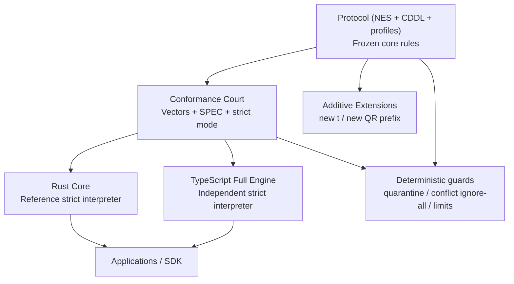

# Architecture

Grain is a layered protocol plus an executable court.

Diagram source: `docs/human/diagrams/architecture.mmd`.

## Layer map

1. Encoding: strict DAG-CBOR, canonical-bytes reject semantics.
2. Identity: CIDv1 (dag-cbor + sha2-256).
3. Signature: COSE_Sign1 narrow profile.
4. Ledger: authorization, revoke/conflict rules, deterministic reducer.
5. E2E + Manifest: capability addressing and deterministic resolution.
6. Transport: GR1 QR profile.
7. Extensibility: additive only inside major version 1.

## Status clarity

- Rust Core is the reference executor.
- TS full engine passes full strict suite; C01 remains a focused byte-path smoke profile.
- Conformance vectors remain the arbiter of behavior.
