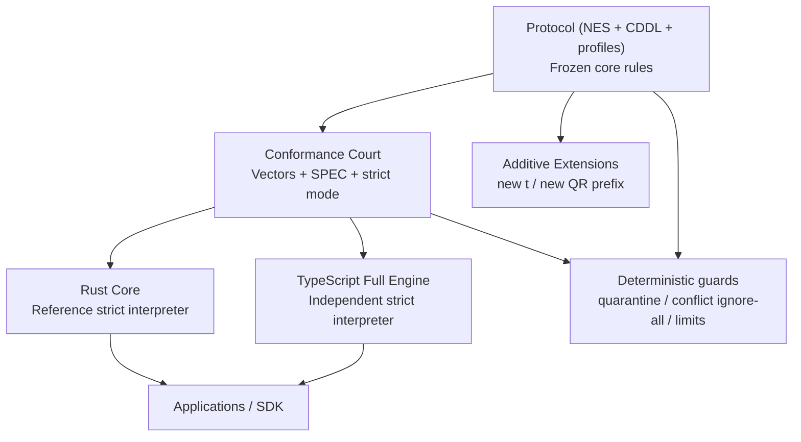

# Architecture

Grain is a layered protocol plus an executable interop court.

Diagram source: `docs/human/diagrams/architecture.mmd`.

## How to read this diagram

- Protocol: the rules themselves.
- Conformance court: vectors plus strict runner contract. If prose and implementations disagree, this layer decides release eligibility.
- Rust Core: the reference executor.
- TypeScript full engine: an independent implementation used to catch drift.
- Applications / SDK: safer builders and orchestration on top of the same protocol rules.
- Additive extensions: new event types or transport prefixes that do not rewrite frozen-core behavior.

## Layer map

1. Encoding: strict DAG-CBOR, canonical-bytes reject semantics.
2. Identity: CIDv1 (dag-cbor + sha2-256).
3. Signature: COSE_Sign1 narrow profile.
4. Ledger: authorization, revoke/conflict rules, deterministic reducer.
5. E2E + Manifest: capability addressing and deterministic resolution.
6. Transport: GR1 QR profile.
7. Extensibility: additive only inside major version 1.

## Important vocabulary

- `reference executor`: the main implementation baseline, but not above spec or vectors.
- `independent implementation`: a second engine used to prove that behavior is not accidental to one codebase.
- `C01`: a small smoke lens for byte-path regressions; it is not a separate compatibility mode.

## Status clarity

- Rust Core is the reference executor.
- TS full engine passes full strict suite; C01 remains a focused byte-path smoke profile.
- Conformance vectors remain the arbiter of behavior.
