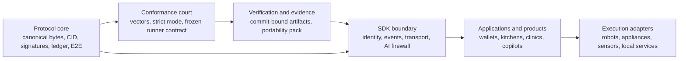

# Future Vision

This document is aspirational and non-normative.

Do not start here if you are new to the repo.
Read `docs/human/start-here.md` or `docs/human/quickstart.md` first.

The protocol source of truth remains:
- `spec/NES-v0.1.md`
- `spec/schemas/grain-v0.1.cddl`
- `conformance/vectors/`
- `conformance/contract/runner_v1.md`

This document answers a different question:

What kind of future becomes possible if the Grain substrate stays stable and more product layers are built on top of it?

It is about direction, not about today's guarantees.

## The Short Version

Grain is not trying to be one more app that stores food history in one more vendor database.

Grain is trying to make physical-event data portable, verifiable, private, and reusable across many systems:
- capture surfaces such as phones, glasses, scanners, and kiosks;
- personal software such as wallets, diet apps, household systems, and assistants;
- institutional systems such as clinics, schools, and kitchens;
- execution systems such as appliances, robots, and other controlled devices.

Food is the first production profile in v0.1.
But the shape of the system is bigger than one food app.

## What Already Exists In This Repository

This future is not built on hand-waving. The repo already contains the hard substrate:

- a frozen core protocol for canonical bytes, CID derivation, COSE signatures, append-only ledger semantics, E2E private sync, and deterministic manifest resolution;
- a shipped conformance suite that acts as executable truth, not just prose;
- two independent strict implementations, in Rust and TypeScript, with divergence checks;
- offline transport through `GR1:` QR payloads;
- commit-bound evidence and portability verification flows;
- an SDK with identity, events, manifest, E2E transport, proof bundles, and a fail-closed AI boundary.

That means the repo already proves something unusual:

The trust substrate exists now.
Most of the missing pieces are domain layers, execution adapters, and product surfaces.

## What Makes Grain Different

The interesting future here is not "one giant platform."

It is a world where one verified record can survive:
- app changes;
- device changes;
- vendor changes;
- country changes;
- AI model changes;
- hardware changes.

That is only possible if the system has all of the following at once:
- canonical bytes;
- deterministic semantics;
- portable signatures;
- private sync;
- an executable interop court;
- a way to keep AI from writing garbage directly into the record layer.

Most systems have one or two of these. Grain is unusual because it is trying to hold all of them together.

## Future Product Surfaces That Are Realistically Enabled

### 1. A Personal Food Memory That Does Not Belong To Any App

A person should be able to keep a durable record of what they ate, what they tolerated, what they repeated, what they avoided, and what outcomes followed.

Not as screenshots.
Not as one app's export format.
As a portable, signed, deterministic event graph.

What this could look like:
- you scan a meal, a prepared plate, a store label, or a restaurant handoff;
- your app stores a verified record in your own Grain graph;
- later, another app can read the same record without depending on the original vendor backend;
- your history survives migration from one product to another.

This is a very practical future, and the repo already contains most of the low-level pieces required for it.

### 2. Smart Glasses As A Capture Surface, Not A Data Silo

Glasses are a realistic future interface for physical-event systems because they sit at the point where attention meets the world.

What matters is not "AI glasses" as a gimmick.
What matters is that the glasses can become a secure input and retrieval surface for verified records.

What this could look like:
- you look at a product, menu, tray, shelf tag, or kitchen handoff;
- the glasses detect a Grain QR or help you construct a candidate record locally;
- the assistant shows what is verified, what is inferred, and what is still uncertain;
- only accepted objects enter the durable record layer;
- later, the same record can be used by another app, another device, or another country.

That is a strong fit for the current SDK direction because the AI boundary is already designed to be fail-closed.

### 3. Kitchens That Remember Intent, Not Just Recipes

Today's recipe systems mostly store presentation-layer artifacts: bookmarks, screenshots, plain text, or vendor-tied metadata.

The more interesting future is a kitchen stack that preserves intent in a portable, machine-readable way.

What this could look like:
- a household or restaurant stores verified records for servings, substitutions, restrictions, and outcomes;
- a new cooking system can import that history instead of forcing everyone to start over;
- a different appliance vendor can consume the same underlying record through a local adapter;
- the person's preferences survive hardware refreshes and software rewrites.

This is where Grain can become the memory layer underneath kitchen software rather than a competitor to it.

### 4. Robot And Appliance Interoperability Through Adapters

The realistic path to robotic execution is not one universal robot protocol that controls every machine directly.

The realistic path is:
- one portable record layer for intent and provenance;
- many local adapters that translate that record into device-specific execution.

What this could look like:
- a Grain object describes a meal event, serving offer, or cook run;
- one kitchen robot maps that object into its own toolchain;
- a different appliance fleet maps the same object into different mechanics;
- both preserve the same user-level intent even if the execution details differ.

This is ambitious, but it is not science fiction.
It is a normal architecture pattern once the record layer is stable.

### 5. Continuity Between Home, Retail, Clinic, And Care Team

Food data becomes much more valuable when it can move between contexts without collapsing into screenshots and manual re-entry.

What this could look like:
- a person records intake at home;
- a clinic imports the same portable history for review;
- a dietitian or coach sees provenance instead of a pasted note;
- a care plan produces new signed records that can return to the person's own system;
- AI can summarize the graph, but the graph itself remains independently verifiable.

This is one of the strongest near-term visions because continuity is usually a data problem before it is a machine-learning problem.

### 6. Institutions With Auditable Meal Records

Schools, hospitals, workplace cafeterias, and other institutions all deal with repeated meal delivery under policy constraints.

What they need is not hype.
They need records that are portable, auditable, and hard to silently mutate.

What this could look like:
- a meal event is recorded once at the point of service;
- ingredient, nutrition, and serving details remain attached to the event graph;
- different authorized systems can read the same object instead of rebuilding parallel copies;
- later reviews can reason over provenance, not just database rows in one vendor system.

This becomes especially valuable where allergies, restrictions, or institutional accountability matter.

### 7. Cross-Border Portability Without Starting Over

A good protocol should let a person keep going when the surrounding ecosystem changes.

What this could look like:
- you move countries or switch ecosystems;
- your new app imports your existing records rather than trapping you in a migration dead end;
- local systems can understand the same record even if the retailers, apps, and services are different;
- the record remains yours, not just a view into somebody else's backend.

This is one of the clearest user-level promises a protocol like Grain can make.

### 8. AI Copilots That Help Without Owning The Truth Layer

A strong future for AI is not "let the model write directly into the database."

A stronger future is:
- AI helps interpret, summarize, compare, suggest, and draft;
- deterministic protocol gates decide what can actually become durable state;
- every accepted object still has canonical bytes, stable IDs, and verifiable provenance.

That lets products use AI without giving up on auditability.
The repo already contains the beginnings of exactly this model.

### 9. Evidence-Grade Consumer And Institutional Products

Most products can say "trust us."
Far fewer can say:

- this record was created under these protocol rules;
- this implementation passed these vectors;
- this release produced this evidence bundle;
- this artifact can be checked independently.

That opens a path to a different class of products:
- regulated products;
- higher-trust health and compliance products;
- products that need to prove behavior across software boundaries;
- products that need a credible story for longevity and migration.

The evidence and stabilization work in this repo already points in that direction.

## Beyond Food

Food is the first production profile, and that focus is real.

The shipped schema and reducer semantics are still food-first today.
That should be stated plainly.

But the core architecture is broader than food, and the repo already says so.
If the substrate remains stable, the same pattern can later support:
- sensor-linked personal records;
- robotics operation events;
- supply-chain traceability;
- medical event provenance;
- other portable, signed, deterministic physical-event systems.

That does not mean "everything is already solved."
It means the foundation is being laid in a way that can expand without rewriting the core.

## What Is Not Built Yet

This future still requires major work above the protocol:

- richer domain profiles and shared ontologies;
- execution adapters for concrete kitchens, robots, appliances, and scanners;
- product-grade apps and interfaces;
- importers for real retailers, restaurants, clinics, and institutions;
- stronger trust and provenance ecosystems around real-world issuers;
- broader reducer semantics beyond the current food-first shipped layer.

The repo should not pretend these things already exist.

The honest claim is stronger than that:
the difficult substrate work is underway now, so those systems can later be built on something durable.

## Why This Matters

The deepest problem is not "how do we make a good app for food."

The deeper problem is:
how do we make records from the physical world survive change without losing meaning, provenance, or user ownership?

If Grain succeeds, the future is not one company controlling the graph.

It is this:
- one record captured once;
- many systems able to verify it;
- many interfaces able to present it;
- many execution layers able to use it;
- and the person who depends on that record never has to start from zero again.

That is the future Grain can realistically grow into:
not fantasy, not magic, but durable interoperability for real life.
